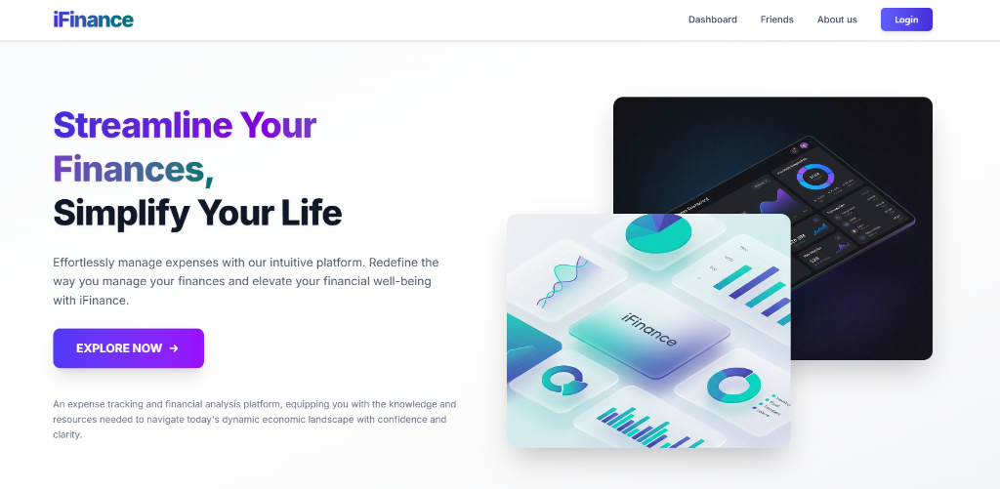

# 📊 iFinance - Expense Management


## Short Description

iFinance is a smart, premium tool designed to help users track income, expenses, and financial activities efficiently. It provides an interactive dashboard, expense analytics, and a powerful friends section to manage and split shared expenses seamlessly.

---
## Are You Solving a Real-World Problem? ✅

**Problem**

Managing group and personal finances can be tedious. People often struggle with:

- Keeping track of personal spending vs shared group costs
- Accurate bill splitting among multiple friends
- Understanding spending habits through visualizations
- Ensuring all participants are included in settlement balances

**Solution**

iFinance helps users by:

- **Unified Tracking**: Income and expenses in one sleek dashboard
- **Smart Split**: Automatic mathematical splitting of shared expenses
- **Inclusive Settlement**: Ensures all friends are factored into balances, even if they haven't contributed yet
- **Visual Analytics**: Gain clarity through turnover and category charts
- **Secure UX**: Authentication guardrails and clean form states

## 🛠️ Technology Stack

🔹 **Frontend**: React, Tailwind CSS, Ant Design
🔹 **Backend**: Node.js, Express.js
🔹 **Database**: MongoDB
🔹 **Deployment**: Render

---

## Key Features

- **User Authentication**: Secure login, signup, and Google OAuth integration
- **Interactive Dashboard**: Add, edit, and delete transactions with ease
- **Analytics View**: Real-time turnover and category-wise analysis
- **Friends & Groups**: Add friends and split bills with automated transaction calculations
- **Responsive Design**: optimized for both desktop and mobile with a modern hamburger menu

--- 

## How to Run iFinance Locally
Follow these steps to set up and run the project on your local system.

📥 **Step 1: Clone the Repository**
```sh
git clone https://github.com/pranjal-2507/Ifinance_expense_tracker.git
cd Ifinance_expense_tracker
```

⚙ **Step 2: Install Dependencies**
Navigate to the Server directory and install dependencies:

```sh
cd Server
npm install
```
Navigate to the client directory and install dependencies:
```sh
cd ../client
npm install
```

▶ **Step 3: Run the Frontend and Backend Servers**
1️⃣ **Run the Backend Server**:
```sh
cd ../Server
npm start
```
2️⃣ **Run the Frontend Server**:
```sh
cd ../client
npm run dev
```

🌐 **Step 4: Access the Application**
- Frontend: `http://localhost:5173`
- Backend API: `http://localhost:3000`

---

**🌍 Live Application**

- **Frontend**: [iFinance Live](https://ifinance.netlify.app/)  
- **Backend API**: [Production Server (Render)](https://pranjal-s56-capstone-expense-tracker.onrender.com)

---

**🐞 Troubleshooting**
- Ensure your `.env` file in the `Server` directory has the correct `MONGODB_URI` and `JWT_SECRET`.
- Check if ports 3000 and 5173 are free.
- Run `npm run build` if you encounter unexpected frontend issues.

Developed with ❤️ for better financial clarity. 🚀


